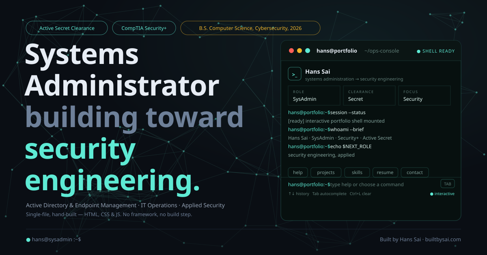
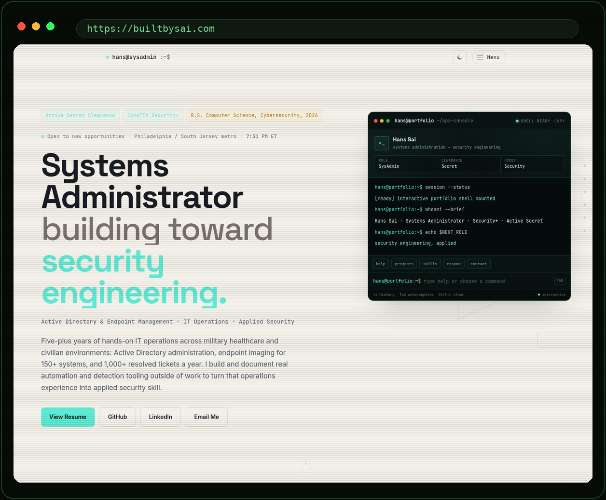
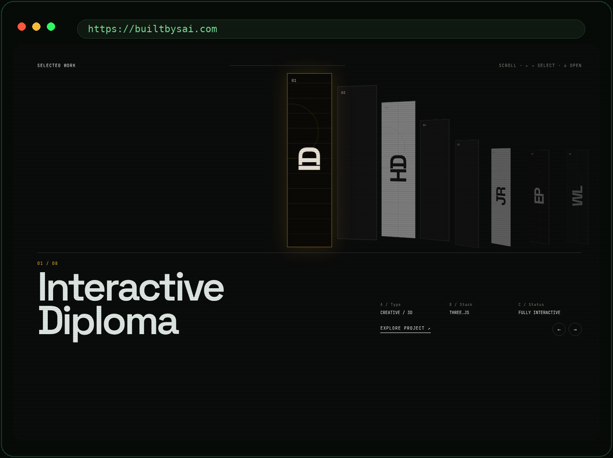

# builtbysai.github.io

<p align="center"></p>

<p align="center"></p>

<p align="center"></p>

Personal portfolio for Hans Sai - Systems Administrator building toward security engineering.

**Live site: [builtbysai.com](https://builtbysai.com)**

## What it is

A single-file, hand-built portfolio: Active Directory / IT operations background, a terminal-style hero with a live three.js particle network, real projects (with test counts and MITRE ATT&CK mappings where relevant), and certifications with linked proof.

No framework, no build step, no bundler. `index.html` is the entire site - HTML, CSS, and JS inline, plus two CDN scripts (three.js for the hero/diploma-adjacent visuals, Lenis for smooth scrolling).

## Structure

```
index.html                the site (everything lives here)
404.html                   custom 404 page (served automatically by GitHub Pages)
manifest.json              web app manifest (icons, theme color)
favicon.ico / favicon-light.ico   favicon (dark/light theme variants)
icons/                     favicon/apple-touch-icon/manifest icon set
headshot.jpeg / headshot-web.webp about-section photo (original + optimized web copy)
screenshots/               project screenshots used in the Projects section
assets/                    README visuals: hero.svg + real site screenshots
certs/                     certification PDFs linked from the Education section
resume/                    resume PDF linked from the hero
files/                     vCard, linked from the footer's "Save Contact" button
```

## Local preview

Nothing to install - open `index.html` directly in a browser, or serve the folder with any static server:

```bash
python3 -m http.server 8000
```

## Deploying

Push to `main`. GitHub Pages serves it directly, no build step.
